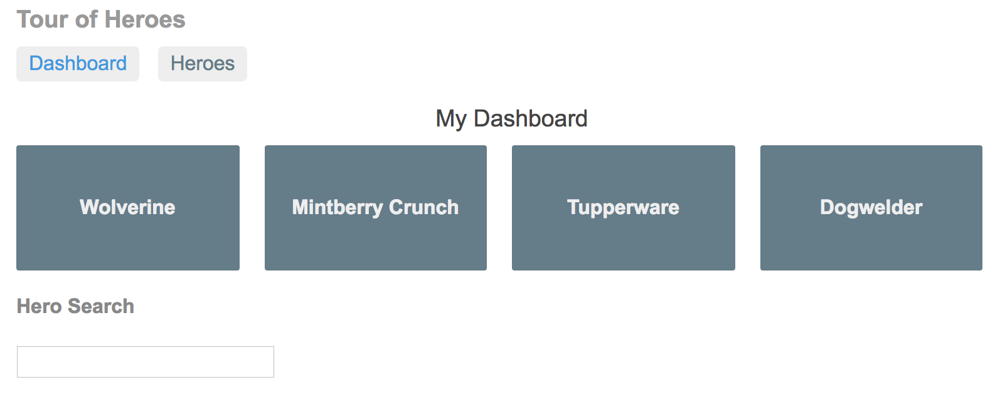
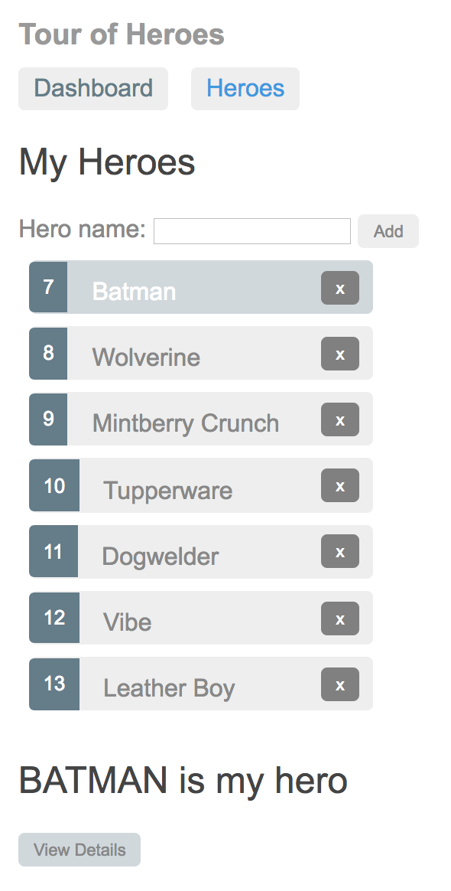
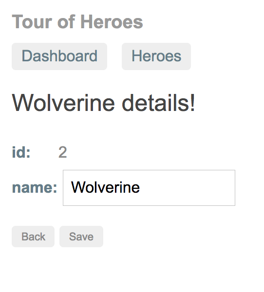
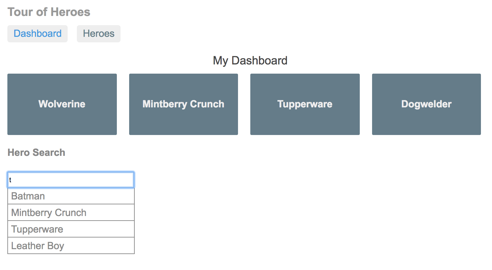

# AngularTourOfHeroesPostgres

This project is a small application built to follow the Tour of Heroes tutorial found on the [Angular.io website](https://angular.io/).

It is meant to show some of the common features of Angular, including:
* Components
* Event binding
* Master / detail architecture
* Services - from mocks, to web API
* Routing
* Observables


<p align="center">
  <figure>
    
    <figcaption>Dashboard view - entry point to the site</figcaption>
  </figure>
</p>

<p align="center">
  <figure>
    
    <figcaption>Heroes view - second main navigation page</figcaption>
  </figure>
</p>

<p align="center">
  <figure>
    
    <figcaption>Details view</figcaption>
  </figure>
</p>

<p align="center">
  <figure>
    
    <figcaption>Live search</figcaption>
  </figure>
</p>

NOTE: This project was generated with [Angular CLI](https://github.com/angular/angular-cli) version 1.0.0.

## Getting Started
This project can be cloned locally, but it will require a configured PostgreSQL database based on the current db settings.

In terminal:
```
psql
create database tourofheroes_dev;
```
This will open PostgreSQL is the terminal and create the development database.

### To run via Angular dev server
Run `ng serve` for a dev server. Navigate to `http://localhost:4200/`. The app will automatically reload if you change any of the source files.

The server would need to be run in a separate tab by running `node server.js`

### Prerequisites

All prerequisites are included with the package.json file EXCEPT the PostgreSQL database.

### Installing

All requirements (except PostgreSQL) are set up via npm. To install all modules, run `npm install`

After that, mock data can be seeded using knex:
```
knex migrate:latest
knex seed:run
```

## Running the tests
Testing is handled by Karma and Protractor

### Unit tests
Run `ng test` to execute the unit tests via [Karma](https://karma-runner.github.io).

### End to end tests
Run `ng e2e` to execute the end-to-end tests via [Protractor](http://www.protractortest.org/).
Before running the tests make sure you are serving the app via `ng serve`.

## Deployment
Run `ng build`. Build files are stored in a dist/ directory for serving in production.

## Built With
* [Angular](https://angular.io/) - Javascript frontend framework
* [Node](https://nodejs.org/en/) - Backend server
* [Express](http://expressjs.com/) - Backend server, routing, middleware
* [Knex](http://knexjs.org/) - SQL query builder
* [PostgreSQL](https://www.postgresql.org/) - SQL database
* [Protractor](http://www.protractortest.org/) - E2E testing for Angular
* [Karma](https://karma-runner.github.io) - Spectacular test runner for Javascript
